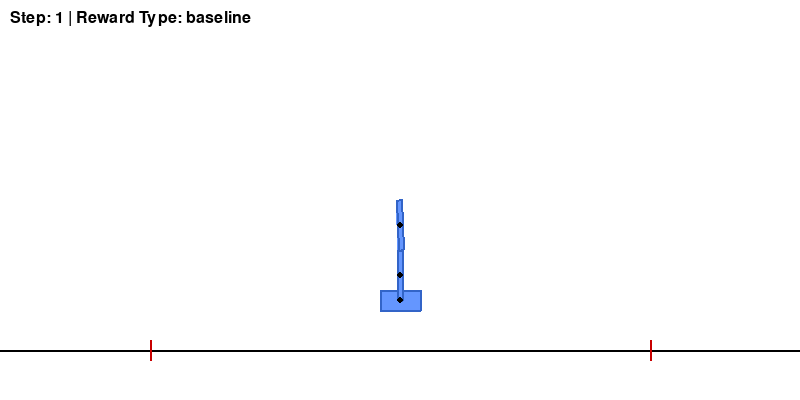
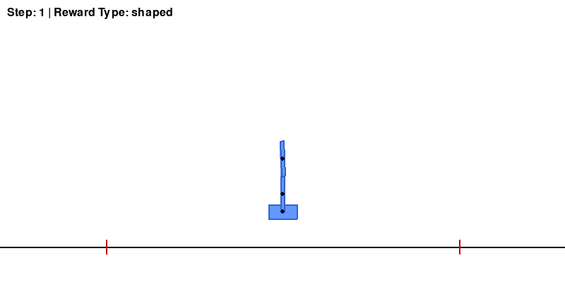
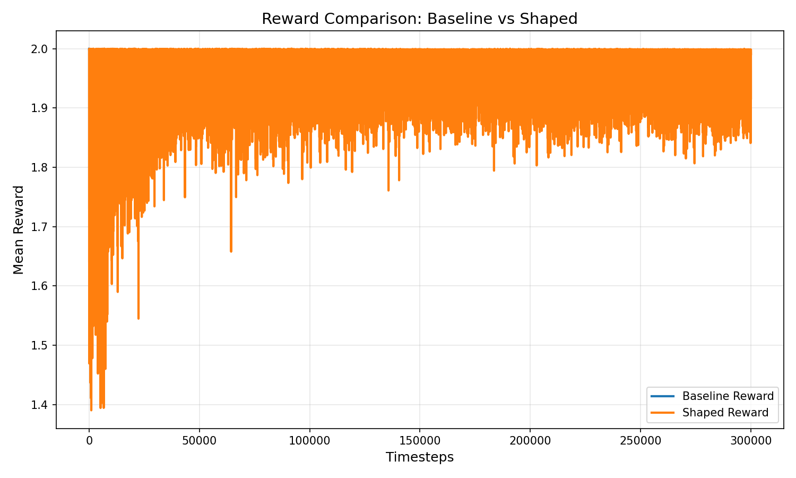

# RL Double Inverted Pendulum (PPO + Pymunk)

A complete reinforcement learning system that trains a PPO agent to balance a **double inverted pendulum** using a custom physics environment built with `pymunk`.

---

## Project Overview

This project demonstrates:

- Custom Gymnasium environment design
- Physics-based simulation using `pymunk`
- Reinforcement learning with PPO (Stable-Baselines3)
- Reward engineering (baseline vs shaped)
- Training, evaluation, logging, visualization, and analysis
- Dockerized reproducible pipeline

---

## Results

### Initial (Untrained Agent)


### Final (Trained PPO Agent)


---

## Performance

- **Mean Reward:** ~241 🔥  
- **Stable Control:** Yes  
- **Learning Efficiency:** Improved with reward shaping  

---

## Reward Comparison



---

### System Architecture

The project follows a modular reinforcement learning pipeline:

- Environment (DoublePendulumEnv): Handles physics simulation using pymunk and provides observations, rewards, and transitions.
- Agent (PPO): Learns a policy using Stable-Baselines3.
- Training Pipeline: Connects the agent and environment, performs learning, and logs metrics.
- Evaluation Pipeline: Loads trained models, runs inference, and generates GIF visualizations.
- Utilities: Handle logging, plotting, and GIF generation.

Workflow:

Environment → PPO Agent → Training → Logging → Evaluation → Visualization

---
## Environment Design

The system simulates a **double inverted pendulum on a cart**.

### Physics Setup

- Engine: `pymunk.Space`
- Gravity + damping applied
- Stable timestep (60 FPS)

### Components

- Cart body (horizontal motion)
- Two pole bodies (linked vertically)

### Constraints

- `GrooveJoint` → restricts cart to horizontal track  
- `PivotJoint` → cart ↔ pole1  
- `PivotJoint` → pole1 ↔ pole2  

---

## Observation Space (6D)

```python
[cart_x, cart_vx, pole1_angle, pole1_ω, pole2_angle, pole2_ω]
```

---

## Action Space

```python
Continuous force ∈ [-1, 1]
```

---

## Reward Function Design

### 🔹 Baseline Reward

```python
cos(θ1) + cos(θ2)
```

- Encourages upright poles only  
- Sparse feedback  

---

### Shaped Reward

```python
Upright Bonus = cos(θ1) + cos(θ2)
Center Penalty = -0.1 * |cart_x|
Velocity Penalty = -0.01 * (|ω1| + |ω2|)
Action Penalty = -0.001 * action²
```

### Rationale

- Improves learning speed  
- Encourages stability  
- Reduces oscillations  
- Produces smoother control  

---

## Project Structure

```
rl-double-pendulum/
│
├── configs/config.yaml
│
├── src/
│   ├── env/environment.py
│   ├── agents/ppo_agent.py
│   ├── training/train_pipeline.py
│   ├── evaluation/evaluate_pipeline.py
│   │
│   └── utils/
│       ├── logger.py
│       ├── plotting.py
│       └── gif_generator.py
│
├── train.py
├── evaluate.py
│
├── logs/
├── models/
├── media/
├── notebooks/analysis.ipynb
```

---
## How to Run

### 1. Setup (Local)

```bash
pip install -r requirements.txt
```

---

### 2. Train

```bash
python train.py --timesteps 500000 --reward_type shaped --save_path models/ppo_shaped
```

---

### 3. Evaluate

```bash
python evaluate.py \
  --model_path models/ppo_shaped.zip \
  --reward_type shaped \
  --episodes 1 \
  --max_steps 300 \
  --gif_path media/agent_final.gif
```

---

### 4. Plot Results

```bash
python src/utils/plotting.py \
  --baseline_csv logs/training_metrics_baseline.csv \
  --shaped_csv logs/training_metrics_shaped.csv \
  --output_path reward_comparison.png
```

---

### 5. Run Tests

```bash
python tests/test_env.py
```

---

## Docker Support

### Build

```bash
docker compose build
```

### Train

```bash
docker compose run --rm train \
  python train.py --timesteps 1000 --reward_type shaped
```

### Evaluate (Headless)

```bash
docker compose run --rm -e SDL_VIDEODRIVER=dummy evaluate \
  python evaluate.py --model_path models/ppo_shaped_300k.zip
```

---

## Outputs

### Logs

- `logs/training_metrics_baseline.csv`
- `logs/training_metrics_shaped.csv`

### Visualizations

- `reward_comparison.png`
- `media/agent_initial.gif`
- `media/agent_final.gif`

---

## Analysis

See detailed training insights in:

```
notebooks/analysis.ipynb
```

### Includes:

- Learning curves  
- Reward distributions  
- Stability analysis  

---

## Author

**Chinni Rakesh**  
B.Tech CSE (AIML)  
Reinforcement Learning Project

---
